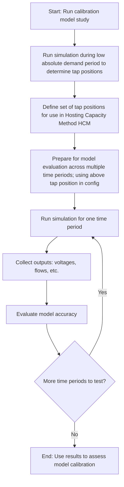

# hosting-capacity-runner

Python client to issue commands to hosting capacity work package.


## Setup

Run the following to install this project.

      pip install zepben.hosting-capacity-runner


## Usage

1. Update the **auth_config.json** file to hold your configuration for authentication.
2. Update the relevant files under **run_configurations** with the feeders, years, and scenarios you want to run.
3. Run the **run_forecast_work_package.py** python script passing the directory where the **auth_config.json** and **config.json** files
   are located (If no config directory is passed it will look for the config files in the current directory).

   ```shell
   hcr . work_package run forecast <WORK_PACKAGE_NAME>
   ```

## Configuration

Config directory should be structured as:

    $CONFIG_DIR:
    | - auth_config.json
    \ - run_configurations:
       | - calibration:
          \ - $CONFIG_NAME.yaml
       | - feeder_override:
          \ - $CONFIG_NAME.yaml
       \ - forecast:
          \ - $CONFIG_NAME.yaml

The `hcr . calibration monitor <CALIBRATION_ID>` script can also be used to retrieve and print progress of your work package.


### Calibration

Use `hcr . work-package run calibration` to launch a calibration workflow.

Modify and use `hcr . calibration monitor <CALIBRATION_ID>` to monitor the status of a calibration workflow.

Use `hcr . calibration list` to retrieve the IDs of all calibration results that have been run.

Modify and use `hcr . calibration get-tx-tap-settings <CALIBRATION_ID>` to retrieve the calculated distribution transformer tap settings from the calibration run.
These settings can then be configured in a hosting capacity work package to apply the tap settings to the models.


#### Workflow

A typical calibration workflow is as follows:

