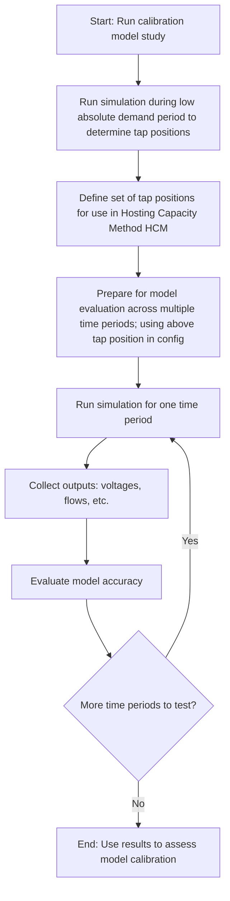

# hosting-capacity-runner

Python script to request run for hosting capacity work package.

## Setup

Run the following to install dependencies.

      pip install -r requirements.txt


## Usage

1. Update the **auth_config.json** file to hold your configuration for authentication.
2. Update the **config.json file** with the feeders, years, and scenarios you want to run.
3. Run the **run_forecast_work_package.py** python script passing the directory where the **auth_config.json** and **config.json** files
   are located (If no config directory is passed it will look for the config files in the current directory).

   ```shell
       ./run_forecast_work_package.py ./config
   ```

The `monitor_progress.py` script can also be used to retrieve and print progress of your work package.


### Calibration

Use `run_calibration.py ./config` to launch a calibration workflow.

Modify and use `monitor_calibration_run.py ./config` to monitor the status of a calibration workflow.

Use `check_calibration_sets.py ./config` to retrieve the IDs of all calibration results that have been run.

Modify and use `get_calibration_transformer_settings.py ./config` to retrieve the calculated distribution transformer tap settings from the calibration run.
These settings can then be configured in a hosting capacity work package to apply the tap settings to the models.

#### Workflow

A typical calibration workflow is as follows:

