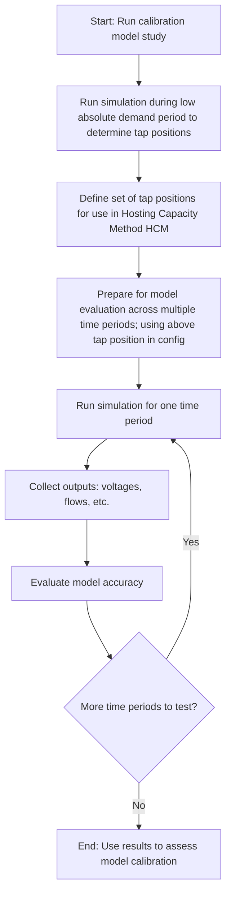

# Hosting Capacity Runner

Python script to request run for hosting capacity work package.

## Setup

Run the following to install dependencies.

```sh
pip install -r requirements.txt
```

## Usage

1. Update the **auth_config.json** file to with the authentication details for the Zepben EWB instance you are connecting to
2. Update the **config.json file** with the feeders, years, and scenarios you want to run.
3. Run the **run_forecast_work_package.py** python script passing the directory where the **auth_config.json** and **config.json** files are located (If no config directory is passed it will look for the config files in the current directory).

    ```shell
    ./run_forecast_work_package.py ./config
    ```

The `monitor_progress.py` script can also be used to retrieve and print progress of your work package.

### Intrinsic Hosting Capacity

Use `run_intrinsic_work_package.py ./config` to find how much load or generation the network can support before hitting a voltage or thermal limit, rather than testing a specific DER scenario. `run_hv_node_headroom_work_package.py ./config` is the HV counterpart, testing HV nodes one at a time.

### Interventions

Use `run_intervention_work_package.py ./config` to run an Intervention work package against a prior (base) work package. Set `INTERVENTION_TYPE` near the top of the script to choose which intervention to run (COMMUNITY_BESS, LV_STATCOMS, DISTRIBUTION_TAP_OPTIMIZATION, DISTRIBUTION_TX_OLTC, TARIFF_REFORM, CONTROLLED_LOAD_HOT_WATER, DVMS, or PHASE_REBALANCING) and `BASE_WORK_PACKAGE_ID` to point at the base work package's ID, then edit the relevant `build_..._intervention()` function for that type's parameters.

### Calibration

1. Use `run_calibration.py ./config` to launch a calibration workflow.
2. Modify and use `monitor_calibration_run.py ./config` to monitor the status of a calibration workflow.
3. Use `check_calibration_sets.py ./config` to retrieve the IDs of all calibration results that have been run.
4. Modify and use `get_calibration_transformer_settings.py ./config` to retrieve the calculated distribution transformer tap settings from the calibration run.

These settings can then be configured in a hosting capacity work package to apply the tap settings to the models.

#### Workflow

A typical calibration workflow is as follows:


```mermaid
flowchart TD
  A[Start: Run calibration model study] --> B[Run simulation during low absolute demand period to determine tap positions]
  B --> C[Define set of tap positions for use in Hosting Capacity Method HCM]
  C --> D[Prepare for model evaluation across multiple time periods; using above tap position in config]
  D --> E[Run simulation for one time period]
  E --> F[Collect outputs: voltages, flows, etc.]
  F --> G[Evaluate model accuracy]
  G --> H{More time periods to test?}
  H -- Yes --> E
  H -- No --> I[End: Use results to assess model calibration]
```
